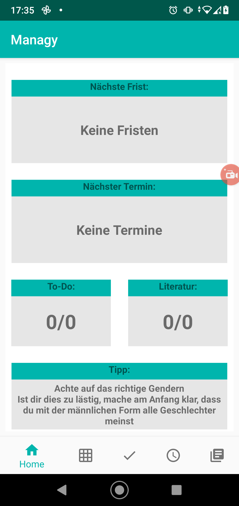

## Managy

- Managy ist eine Android App welche im Rahmen des Studienmoduls Software Engineering als Gruppenprojekt durchgeführt wurde
- Die Anforderungen welche an die App gestellt wurden, wurden in einem [Lastenheft](https://mordragt.github.io/managy/index.html) zusammengetragen

### Startseite

### Kalender

### Todo

### Fristen

### Literatur

